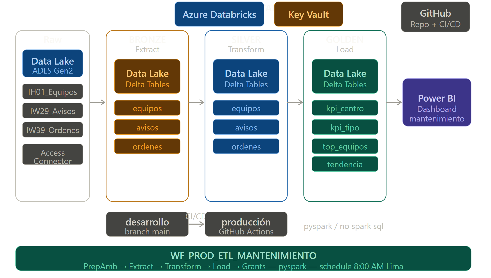
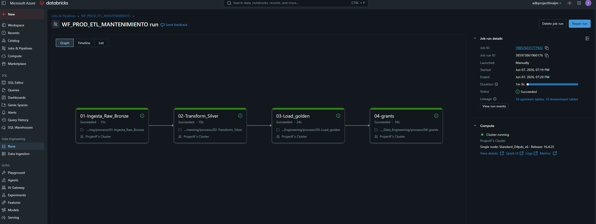
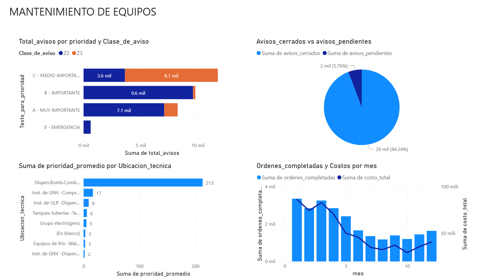

# ETL Gestión de Mantenimiento de Equipos - Databricks

Pipeline ETL desarrollado en Azure Databricks utilizando arquitectura Medallion (Bronze → Silver → Gold) para el análisis de gestión de mantenimiento de equipos industriales (bombas, tanques, refrigeración) a través de avisos y órdenes de mantenimiento preventivo y correctivo.

## Descripción

Pipeline que transforma datos crudos de equipos, avisos y órdenes de mantenimiento, implementando la Arquitectura Medallion en Azure Databricks con CI/CD completo y Delta Lake para garantizar consistencia ACID.

## Características Principales

- ETL Automatizado - Pipeline completo con despliegue automático via GitHub Actions
- Arquitectura Medallion - Separación clara de capas Bronze → Silver → Gold
- CI/CD Integrado - Deploy automático en cada push a main
- Dashboard Power BI - Visualización de KPIs de mantenimiento
- Delta Lake - ACID transactions y time travel capabilities
- Unity Catalog - Gobernanza y seguridad de datos

## Arquitectura


## Datasets

| Dataset | Descripción | Registros |
|---|---|---|
| IH01_Equipos.csv | Maestro de equipos por planta y centro de coste | 10,401 |
| IW29_avisos.csv | Avisos de mantenimiento preventivo y correctivo | 30,412 |
| IW39_ordenes.csv | Órdenes de mantenimiento con costos y tiempos | 30,116 |

## Tablas Gold generadas

| Tabla | Descripción |
|---|---|
| kpi_mantenimiento_por_centro | KPIs de mantenimiento por planta y centro de coste |
| kpi_avisos_por_tipo_prioridad | Distribución de avisos por tipo y prioridad |
| top_equipos_mayor_mantenimiento | Top 100 equipos con más averías |
| tendencia_mensual_mantenimiento | Evolución mensual de costos y órdenes |

## Estructura del repositorio
```
├── datasets/               # Datasets fuente del ETL (.csv)
├── proceso/                # Notebooks del ETL
│   ├── 00-Preparacion_Ambiente
│   ├── 01-Ingesta_Raw_Bronze
│   ├── 02-Transform_Silver
│   ├── 03-Load_golden
│   └── 04-grants
├── PrepAmb/                # Scripts SQL de preparación de ambiente
├── seguridad/              # Scripts SQL de GRANTS
├── reversion/              # Scripts de DROP tablas y schemas
├── .github/workflows/      # CI/CD pipeline (deploy.yml)
├── dashboard/              # Dashboard Power BI
```

## Servicios Azure utilizados

| Servicio | Nombre | Uso |
|---|---|---|
| Azure Data Lake Storage Gen2 | adlprojectof | Capa Raw, Bronze, Silver, Gold |
| Azure Databricks | adbprojectfinaljm | Procesamiento ETL |
| Access Connector | ac-projectf | Managed Identity |
| Unity Catalog | adbprojectfinaljm | Gobernanza de datos |


### 1. Clonar el repositorio

```bash
git clone https://github.com/joelmanccow-pixel/-databricks_project_Data_Engineering
```

### 2. Configurar GitHub Secrets

En tu repositorio: Settings → Secrets and variables → Actions

| Secret | Descripción |
|---|---|
| DATABRICKS_ORIGIN_HOST | URL del workspace Databricks |
| DATABRICKS_ORIGIN_TOKEN | Token de acceso Databricks |
| DATABRICKS_DEST_HOST | URL del workspace destino |
| DATABRICKS_DEST_TOKEN | Token de acceso destino |

### 3. Ejecutar el pipeline

```bash
git add .
git commit -m "feat: deploy ETL mantenimiento"
git push origin main
```

GitHub Actions ejecutará automáticamente:
- Export de notebooks desde Databricks
- Deploy al workspace de producción
- Creación del workflow WF_PROD_ETL_MANTENIMIENTO
- Ejecución completa: Bronze → Silver → Gold → Grants
- Monitoreo y reporte de resultados

## CI/CD
Workflow: Databricks ETL Mantenimiento Deploy
```
├── Export notebooks desde Databricks workspace
├── Deploy notebooks al workspace producción
├── Eliminar workflow anterior (si existe)
├── Obtener cluster ID
├── Crear workflow WF_PROD_ETL_MANTENIMIENTO
├── Ejecutar pipeline automáticamente
└── Monitorear hasta completar
```


Schedule: Diario 8:00 AM (America/Lima)
Timeout total: 2 horas
Max concurrent runs: 1

## Ejecución manual en Databricks

Navegar a `/Workspace/.../Proceso` y ejecutar en orden:
00-Preparacion_Ambiente  → Preparar ambiente y schemas
01-Ingesta_Raw_Bronze    → Capa Bronze
02-Transform_Silver      → Capa Silver
03-Load_golden           → Capa Gold
04-grants                → Permisos y seguridad

## Dashboard

Dashboard Power BI con KPIs de mantenimiento:
- Costo total por tipo de aviso
- Distribución de avisos por tipo y prioridad
- Top equipos con mayor número de averías
- Tendencia mensual de órdenes de mantenimiento y costos



[link](dashboard/enlace.txt)

## Monitoreo

En Databricks → Workflows → WF_PROD_ETL_MANTENIMIENTO

En GitHub → Actions → Databricks ETL Mantenimiento Deploy

## Autor

Jehnmar Joel Mancco cunyas
Data Engineering | Azure Databricks | Delta Lake | CI/CD